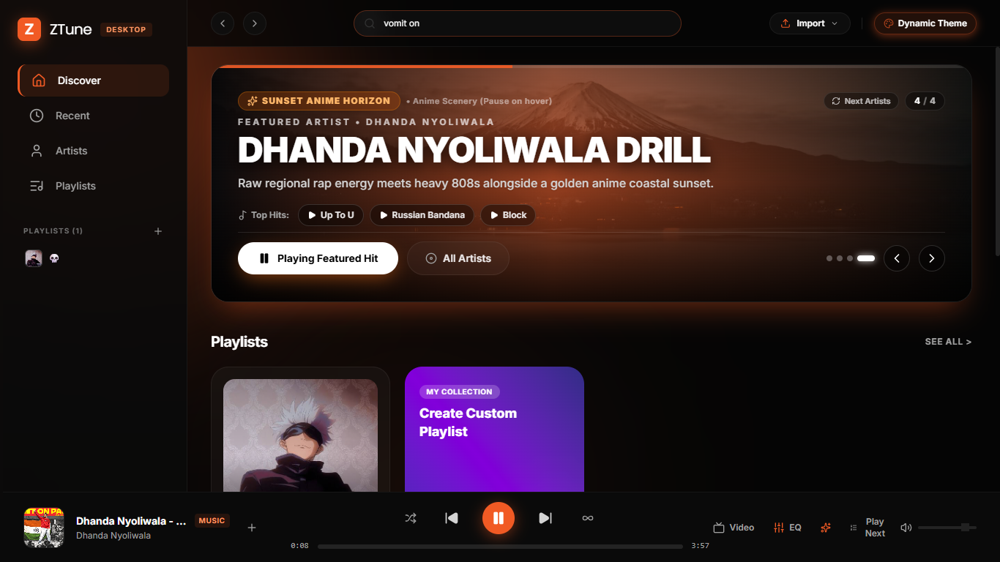
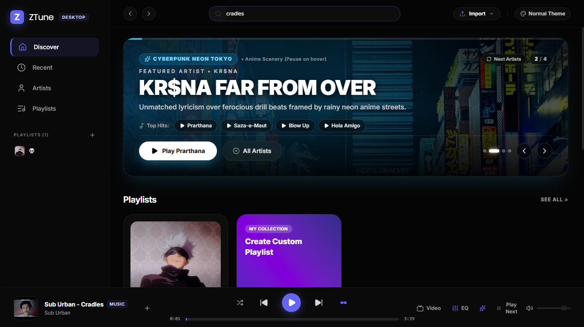

# ZTune

<p align="center">
  
</p>

<h3 align="center">Your music. Your mood. Your way.</h3>

<p align="center">
  A modern, immersive desktop music player built for discovering,<br>
  organizing, and enjoying your music.
</p>

<p align="center">
  <a href="#download">Download</a> •
  <a href="#features">Features</a> •
  <a href="#screenshots">Screenshots</a> •
  <a href="#getting-started">Getting Started</a> •
  <a href="#contributing">Contributing</a>
</p>

<p align="center">
  
  
  
</p>

---

## What is ZTune?

**ZTune** is a modern desktop music player focused on making music discovery and playback feel simple, visual, and immersive.

Instead of overwhelming you with controls and menus, ZTune puts the things that matter most front and center:

* Discover new music
* Search for songs and artists
* Build your playlists
* Control playback
* Manage your queue
* Customize your listening experience
* Switch between different visual themes

ZTune is designed primarily for Windows desktop, with a sleek dark interface and a visual experience that changes with the selected theme.

---

## Features

### Music Search

Search for your favorite:

* Songs
* Artists
* Music catalog content
* YouTube Music content

The global search bar keeps discovery accessible from anywhere in the application.

### Discover

The **Discover** page is the heart of ZTune.

Explore featured artists and music through large visual cards designed to make discovering music feel more engaging.

Featured sections can showcase:

* Artists
* Popular tracks
* Recommended music
* Themed music experiences

### Artist Discovery

Explore artists through immersive featured sections.

Each featured artist can have its own:

* Background artwork
* Theme
* Featured tracks
* Artist information
* Playback action

### Playlists

Create and manage your personal music collections.

ZTune provides a dedicated playlist section where you can access your saved playlists and create new ones.

#### Create a playlist

Simply select:

**Create Custom Playlist → Add your music → Start listening**

### Persistent Music Player

The bottom player stays accessible while navigating through ZTune.

It provides quick access to:

* Play / Pause
* Previous track
* Next track
* Shuffle
* Repeat
* Volume
* Video
* EQ
* Queue
* Playback progress

You don't need to leave the page you're browsing just to control your music.

### Equalizer

Fine-tune your listening experience through the built-in **EQ** controls.

Adjust your audio experience without leaving the main music interface.

### Video Mode

When supported by the current track, ZTune provides a dedicated **Video** option directly from the player.

This keeps audio and video playback accessible from the same interface.

### Queue Management

Manage what's playing next without interrupting your current track.

The player provides quick access to the upcoming queue and playback controls.

### Dynamic Themes

ZTune isn't limited to one static appearance.

The application supports dynamic visual themes that can completely change the atmosphere of the player.

#### Dynamic Theme

A warm, expressive theme with strong orange accents and atmospheric visuals.

#### Normal Theme

A cooler interface with blue and purple accents and a cleaner visual atmosphere.

The goal is to make the player feel alive while keeping the interface readable and comfortable.

### Dark Desktop Interface

ZTune is designed around a dark desktop interface.

The dark UI:

* Reduces visual distractions
* Keeps album artwork prominent
* Makes bright accent colors stand out
* Creates a cinematic music-player experience
* Works especially well with dynamic themes

---

## Screenshots

### Discover — Dynamic Theme

<p align="center">
  
</p>

<p align="center">
  <em>Discover artists and music through an immersive dynamic theme.</em>
</p>

### Discover — Normal Theme

<p align="center">
  
</p>

<p align="center">
  <em>A clean, cool interface for everyday listening.</em>
</p>

---

## Interface Overview

ZTune keeps navigation simple and familiar.

| Section       | Description                                |
| ------------- | ------------------------------------------ |
| **Discover**  | Explore featured artists and music         |
| **Recent**    | Access recently played content             |
| **Artists**   | Browse artists                             |
| **Playlists** | Manage your personal playlists             |
| **Search**    | Search songs, artists, and catalog content |
| **Player**    | Control the currently playing track        |
| **EQ**        | Adjust audio controls                      |
| **Video**     | Access video playback                      |
| **Queue**     | Manage upcoming tracks                     |

---

## Download

### Windows

The easiest way to use ZTune is to download the latest **Windows ****`.exe`**** release**.

### Recommended

Go to the **Releases** section of the repository and download the latest stable version.

Typical releases may contain:

```text
ZTune-v1.0.0/
│
├── ZTune-Setup.exe
└── ZTune-Portable.exe
```

### Installer

If you download:

```text
ZTune-Setup.exe
```

Simply:

1. Download the installer.
2. Run `ZTune-Setup.exe`.
3. Follow the installation steps.
4. Launch ZTune.
5. Start listening.

### Portable Version

If a portable build is available:

```text
ZTune-Portable.exe
```

you can simply download and launch it.

No traditional installation is required.

---

## Quick Start

Want to start listening immediately?

```text
Download
   ↓
Install / Launch
   ↓
Search for music
   ↓
Choose a track
   ↓
Press Play
   ↓
Enjoy
```

---

## Releases

ZTune releases are distributed through the project's release page.

Each release may contain:

| File                 | Description              |
| -------------------- | ------------------------ |
| `ZTune-Setup.exe`    | Windows installer        |
| `ZTune-Portable.exe` | Portable Windows version |
| Release Notes        | Changes and improvements |

### Versioning

ZTune follows versioned releases such as:

```text
v1.0.0
v1.1.0
v1.2.0
```

Always download the latest stable release unless you specifically want to test an older version.

---

## Windows SmartScreen

Because ZTune may be distributed as an independently developed Windows application, Windows Defender SmartScreen may occasionally display a warning for a newly released executable.

If this happens:

1. Make sure you downloaded ZTune from the official project repository.
2. Verify that the file belongs to the intended ZTune release.
3. Only proceed if you trust the source.

> Never download ZTune executables from unofficial or unknown websites.

---

## Design Philosophy

ZTune follows a simple design philosophy:

### Music first

The interface is intentionally focused around the currently playing music and the artwork associated with it.

### Minimal, not empty

Controls are available when needed without making the interface feel cluttered.

### Visual, not distracting

Artwork and dynamic backgrounds create atmosphere while the interface remains readable.

### Personal

Themes, playlists, queue controls, and playback options allow the experience to adapt to the listener.

---

## Project Structure

A typical ZTune repository can be organized like this:

```text
ZTune/
│
├── assets/
│   ├── ztune-logo.png
│   ├── ztune-dynamic-theme.png
│   └── ztune-normal-theme.png
│
├── src/
│   └── ...
│
├── README.md
├── LICENSE
└── ...
```

---

## Contributing

Contributions, ideas, bug reports, and suggestions are welcome.

### Reporting a Bug

Before opening an issue:

1. Make sure you're using the latest version.
2. Check whether the issue has already been reported.
3. Include clear steps to reproduce the problem.
4. Include screenshots or error messages when useful.

A good bug report should contain:

```text
Version:
Operating System:
What happened:
Steps to reproduce:
Expected behavior:
Actual behavior:
Screenshots / logs:
```

---

## Disclaimer

ZTune is an **independent, third-party desktop application**.

ZTune is not affiliated with, sponsored by, endorsed by, or officially connected with **YouTube, YouTube Music, Google, Spotify, or any other third-party music service** unless explicitly stated.

All third-party trademarks, logos, artist names, album artwork, music, and related intellectual property belong to their respective owners.

ZTune does not claim ownership of third-party content made available through supported services.

Users are responsible for using ZTune in accordance with applicable laws and the terms of the services they access.

---

## Privacy

ZTune's handling of user data depends on the features and services used by the application.

Before distributing a production release, document here:

* What information ZTune stores
* Whether playback history is stored
* Whether playlists are stored locally
* Whether analytics are collected
* What third-party services are contacted
* Whether user data leaves the device

> Update this section to accurately reflect the final implementation of ZTune. Do not make privacy claims that aren't implemented and verified.

---

## License

ZTune is distributed under the license included in this repository.

See:

```text
LICENSE
```

for the complete licensing terms.

---

## Acknowledgments

ZTune is made possible by the developers, maintainers, libraries, APIs, frameworks, and open-source projects used throughout the application.

Special thanks to everyone who contributes to the tools and technologies that make projects like ZTune possible.

Third-party licenses and attributions should be listed in the appropriate project documentation.

---

## Support ZTune

If you enjoy ZTune:

* Star the repository
* Report bugs
* Suggest features
* Contribute improvements
* Share the project with others

Every bit of feedback helps make ZTune better.

---

<p align="center">
  
</p>

<h3 align="center">ZTune</h3>

<p align="center">
  <strong>Your music. Your mood. Your way.</strong>
</p>

<p align="center">
  Built for music lovers.
</p>
